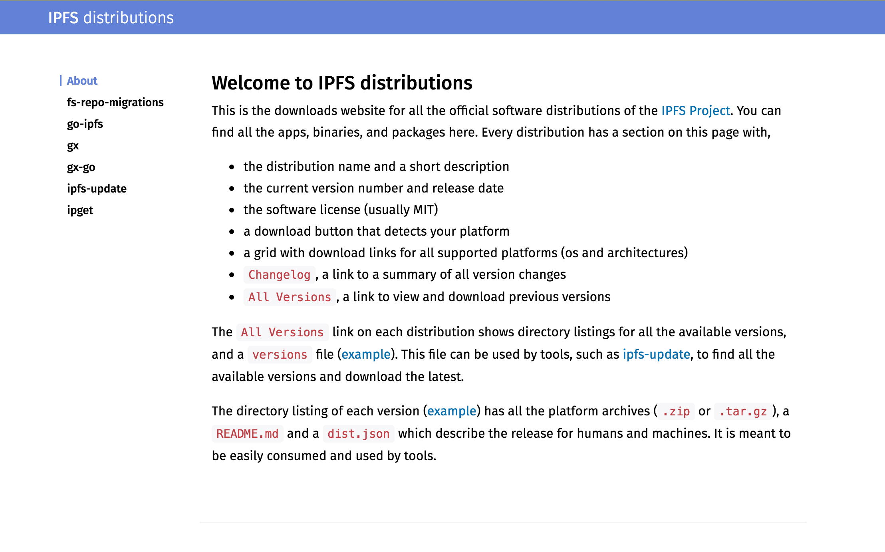

[dist.ipfs.io](https://dist.ipfs.io/) is the new distributions page for IPFS. This is the new one-stop-shop for finding and downloading all official binaries that the IPFS Team produces.

## The IPFS Distributions Website

The distributions website itself is served by, hosted, and distributed through IPFS. The website assets and all of the binaries form one large IPFS content graph. This means that you can view and use this website through any IPFS node, even your own local ipfs node. All you need to do is to run an IPFS daemon and direct your browser to http://localhost:8080/ipns/dist.ipfs.io. Of course, you'll need to be online and connected to the internet, so you can find other ipfs nodes that have this website. 

### Download Deduplication

If you download files from dist.ipfs.io using your local IPFS node, future downloads **may be** much faster. When you click to download a file, your browser will ask to download it from your local IPFS node. In turn, your IPFS node will fetch the relevant content from other nodes in the network, and return it to your browser. Your browser will place the file in your Downloads folder, or wherever you directed it to. 

However, once your local IPFS node has fetched the content, it will cache it locally for some time. This makes subsequent downloads of the exact same content instantaneous! Your browser asks the IPFS node for the content; the node already has it and simply returns it, without ever having to connect to other nodes. This also means that if other IPFS nodes in your local area network try to download the file, they may be able to fetch it from your node. Once you have the content locally, this can even work while disconnected from the internet!

It may also make downloading **new** versions much faster, because different versions of large binary files often have lots of duplicated data. IPFS represents files as a Merkle DAG (a datastructure similar to a [merkle tree](https://en.wikipedia.org/wiki/Merkle_tree)), much like Git or BitTorrent. Unlike them, when IPFS imports files, it chunks them to deduplicate similar data within single files. So when you need to download a new version, you only download the parts that are new or different - this can make your future downloads faster!

## Project details

Every distribution has a section, which includes:

- The distribution name and a short description;
- The current version number and release date;
- The software license (usually MIT);
- A download button that detects your platform and automatically suggests the appropriate distribution for you;
- A grid with download links for all supported platforms (operating system and architectures);
- A `Changelog`, a link to a summary of all version changes;
- An `All Versions`, a link to view and download previous versions.

The `All Versions` link on each distribution shows directory listings for all the available versions, and a `versions` file ([example](https://dist.ipfs.io/go-ipfs/versions)). This file can be used by tools, such as [ipfs-update](https://dist.ipfs.io/#ipfs-update), to find all the available versions and download the latest.

The directory listing of each version ([example](https://dist.ipfs.io/go-ipfs/v0.3.11)) has all the platform archives (`.zip` or `.tar.gz`), a `README.md` and a `dist.json` which describe the release for humans and machines. It is meant to be easily consumed and used by tools.

The site is also used directly by [`ipfs-update`](https://github.com/ipfs/ipfs-update) to update IPFS.

## Project Prerequisites

In order to be added to the distributions page, a product must:

- Originate from the IFPS community;
- Have high-quality UX and documentation;
- Be well maintained and active.

If you think that a product should be there that isn't, get in touch.

## Future Plans

In the future, we hope to:

- Enable code signing, for progress on this subject you can check this [pull request](https://github.com/ipfs/distributions/pull/51).
- Enable closer integration with package managers.
- Add more products.
- Host more screenshots of the tools directly in the Distributions page.
- Import binaries more intelligently in order to enhance change of deduplication.
- Add the software license (usually MIT) to each distribution.

## Contribute

We welcome any and all sorts of contributions! File issues or send us patches at [ipfs/distributions](https://github.com/ipfs/distributions).

Last but not least, a huge thank you to [@dignifiedquire](https://github.com/dignifiedquire) for his amazing work with the Dist page. None of this would be possible without him.
